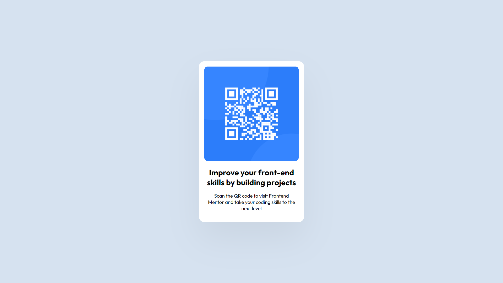

# Frontend Mentor - QR code component solution

This is a solution to the [QR code component challenge on Frontend Mentor](https://www.frontendmentor.io/challenges/qr-code-component-iux_sIO_H). Frontend Mentor challenges help you improve your coding skills by building realistic projects.

## Table of contents

- [Overview](#overview)
  - [Screenshot](#screenshot)
  - [Links](#links)
- [My process](#my-process)
  - [Built with](#built-with)
  - [What I learned](#what-i-learned)
  - [Continued development](#continued-development)
- [Author](#author)

**Note: Delete this note and update the table of contents based on what sections you keep.**

## Overview

This is a simple landing page showing the QR code.

### Screenshot

### Links

- Solution URL: https://www.frontendmentor.io/solutions/qr-code-project-solution-HJ8u8C3Xc
- Live Site URL: https://rakeshkumarnahak.github.io/qr-code-component-main/

## My process

### Built with

- Semantic HTML5 markup
- CSS custom properties
- Flexbox
- Mobile-first workflow

### What I learned

This was a simple project but still I recollected many basic css properties and project developement workflow.

### Continued development

During the course of the project I faced some problems in figuring out the process to center an element vertically. I later learned about the same and found some more information about it.

## Author

- Website - [Rakesh Kumar Nahak](https://linkedin.com/in/rakesh-nahak-a673921a4)
- Frontend Mentor - [@rakeshkumarnahak](https://www.frontendmentor.io/profile/rakeshkumarnahak)
- Twitter - [@rakeshKnahak](https://twitter.com/RakeshKNahak)
